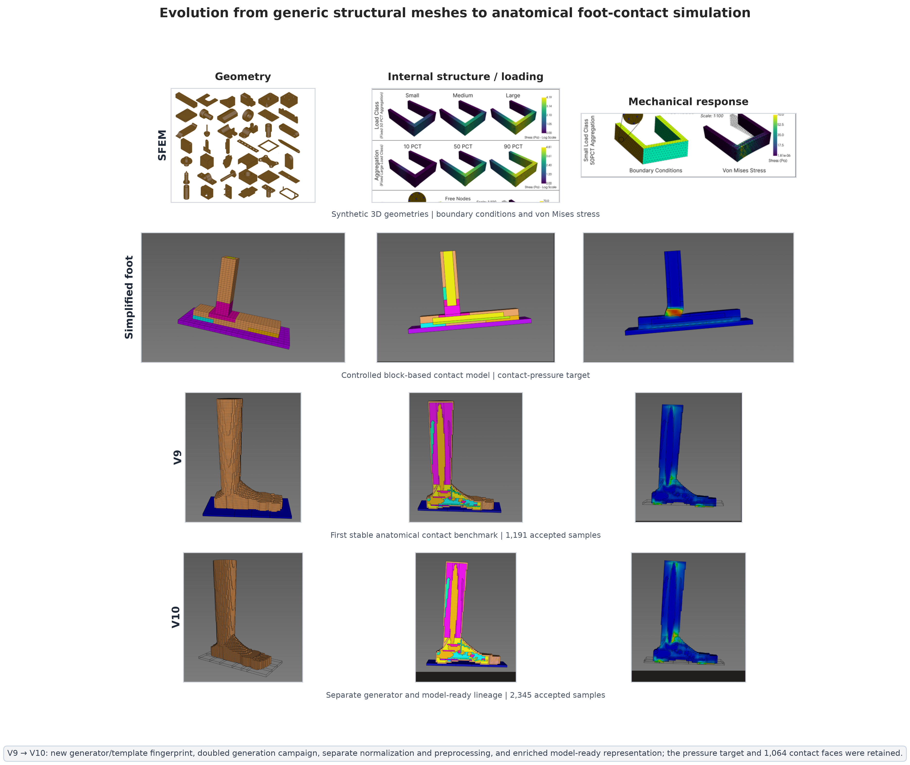
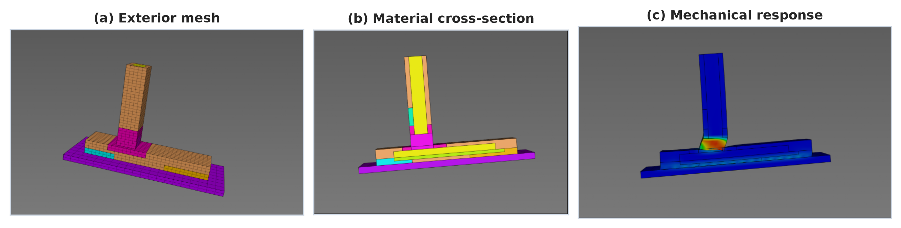
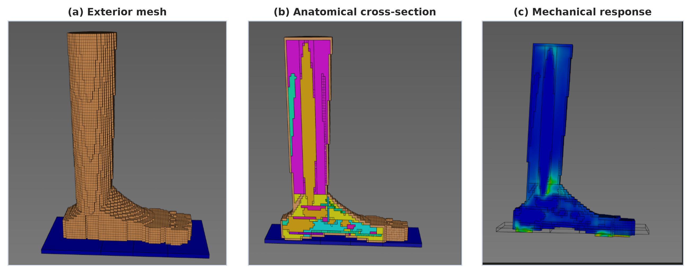
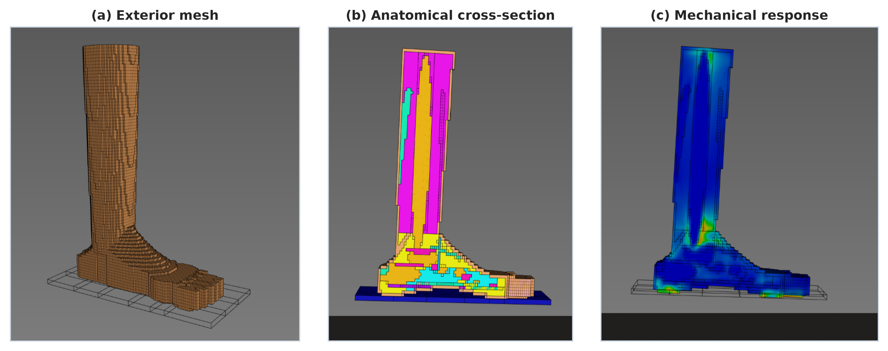
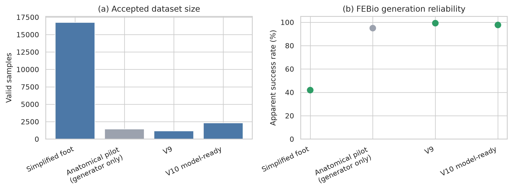
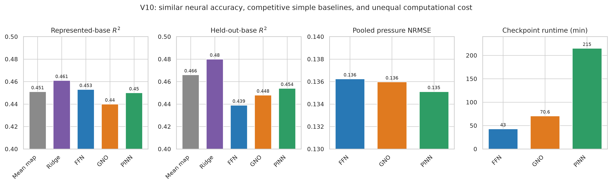

# FEBio Foot Simulation-to-Surrogate Pipeline

An end-to-end engineering pipeline that turns parameterized FEBio foot models
into quality-controlled datasets and compares FFN, graph neural operator, and
physics-informed neural surrogates. It accompanies the OrthoSense paper and is
organized as a portfolio-ready example of simulation automation, HPC workflows,
data engineering, and scientific machine learning.

This is one half of the OrthoSense paper companion. The linked SFEM study is
available in [`tobr2000/sfem-surrogate-modeling`](https://github.com/tobr2000/sfem-surrogate-modeling).

## At a glance

| | |
|---|---|
| **Problem** | Turn parameterized finite-element foot models into validated datasets and fast ML surrogates. |
| **My contribution** | Built the simulation automation, manifest-driven dataset pipeline, QA tooling, training workflows, and comparative FFN/GNO/PINN evaluation. |
| **Scale** | Twelve simplified-foot morphology families plus two later anatomical/contact model lineages. |
| **Methods** | FEBio, Python, Slurm, FFN, graph neural operators, physics-informed training, and W&B-based experiment selection. |
| **Evidence** | Versioned manifests, nine selected-run bundles, benchmark tables, dataset-quality checks, and paper-facing figures. |

The simplified-foot comparison selected a GNO validation pressure NRMSE of
`0.0254`, compared with `0.0412` for the FFN and `0.1189` for the PINN. On the
more difficult V9 and V10 anatomical lineages, selected validation NRMSE values
clustered around `0.105` and `0.135`, making the generalization gap visible
rather than hiding it. Full values and selection criteria are recorded in
[`results/tables/selected_runs.csv`](results/tables/selected_runs.csv).



| Simplified foot | Anatomical V9 | Anatomical V10 |
|---|---|---|
|  |  |  |

## Pipeline

1. Generate parameter manifests and FEBio inputs.
2. Execute simulations locally or through Slurm arrays.
3. Extract nodal, element, contact, and reaction outputs.
4. Package and validate model-ready datasets.
5. Train and evaluate FFN, GNO, and PINN surrogates.
6. Select checkpoints from exported histories and reproduce paper figures.

## From one template to 12 base families and thousands of samples

The simplified-foot dataset was generated programmatically rather than
assembled manually:

1. `scripts/generate_base_templates.py` parses one source `.feb` XML model.
2. Twelve predefined morphology profiles vary foot length/width, arch lift,
   leg length, and toe splay through shared transformation code.
3. The generator writes 12 explicit bases plus `base_model_profiles.json`,
   including required surfaces, materials, domains, load controllers, and split
   roles. Bases 0–9 are training families; bases 10–11 are geometry holdouts.
4. `scripts/generate_manifest.py` assigns each sample to a family and, from a
   deterministic per-sample seed, draws material, contact, loading, boundary,
   and permitted geometric parameters from documented ranges.
5. `scripts/run_batch.py` resolves the base, renders a sample-specific `.feb`,
   executes FEBio, checks termination, extracts fields, and records its summary.
6. `scripts/pack_batch.py` packages successful simulations into shards; training
   QA then checks schema, numerical health, and lineage.

V9 and V10 represent later anatomical/contact lineages. They follow the same
manifest → render → solve → extract → validate pattern with lineage-specific
ranges and post-processing.

```bash
python scripts/generate_base_templates.py \
  --source examples/febio/simplefoot_stance_ligamented_base.feb \
  --out-dir templates/base_models

python scripts/generate_manifest.py \
  --count 40000 --dataset-id simplified_foot \
  --base-profiles templates/base_models/base_model_profiles.json \
  --out data/manifests/simplified_foot.jsonl

python scripts/run_batch.py \
  --dataset-id simplified_foot \
  --manifest data/manifests/simplified_foot.jsonl \
  --template templates/base_models --start 0 --count 500
```



## Repository map

- `scripts/`: manifest generation, model rendering, execution, extraction, and packing;
- `training/`: dataset loaders, models, training, evaluation, and QA tooling;
- `examples/febio/`: one compact simplified model plus canonical V9/V10 examples;
- `data/manifests/`: compact dataset definitions, not full simulation datasets;
- `results/paper_runs/`: nine selected W&B evidence bundles;
- `results/tables/`: auditable checkpoint selections;
- `results/figures/`: paper-facing pipeline, quality, benchmark, and stability figures.

## Paper-selected runs

| Dataset | FFN | GNO | PINN |
|---|---|---|---|
| Simplified foot | `ccckxbl1` | `vc9i4yam` | `5kvwpk4r` |
| V9 model-ready | `5ei6h9ei` | `1chrepk8` | `l9tfvnyi` |
| V10 model-ready | `dp1yr25j` | `bbsqwzck` | `ljkknpce` |

The selection metric is validation pooled contact-pressure NRMSE. Exact steps,
epochs, runtimes, and values are recorded in `results/tables/selected_runs.csv`.



## Contribution and provenance

The original FEBio geometries and third-party software are not presented as my
work. My contribution is the engineering layer around them: parameterized model
generation, deterministic sampling, batch execution, extraction, validation,
dataset packaging, surrogate-model training, experiment tracking, and
cross-lineage evaluation.

The repository separates code from large datasets and records the lineage of
the public model-ready releases. See [`data/README.md`](data/README.md) and
[`CITATION.cff`](CITATION.cff) for availability, attribution, and citation
details.

## Quick start

Install Python 3.11+, FEBio 4, and the packages in `requirements.txt`.

```bash
python scripts/generate_manifest.py --count 10 --dataset-id smoke --out data/manifests/smoke.jsonl
python scripts/run_batch.py --help
python training/train_ffn.py --help
```

The cluster wrappers retain the structure used for the study but must be
adapted to local partitions, paths, modules, and virtual environments.

## Data availability

Compact final-state, model-ready releases are deposited separately on Zenodo:

- **V9:** [doi:10.5281/zenodo.21371916](https://doi.org/10.5281/zenodo.21371916)
- **V10:** [doi:10.5281/zenodo.21372171](https://doi.org/10.5281/zenodo.21372171)

Each record contains `.npz` samples, JSON metadata, and a SHA-256 manifest. The
much larger per-timestep histories are intentionally excluded. The DOIs are
reserved and will resolve after the Zenodo records are published. See
`data/README.md` for dataset lineage and field-level documentation.

## Scope and limitations

This is research software built around the represented FEBio geometries,
materials, boundary conditions, and contact formulation. Surrogate predictions
must not be treated as clinically or mechanically validated decisions.

## Citation and licence

See `CITATION.cff`. Code is released under MIT unless a file states otherwise.
FEBio models, anatomical geometry, datasets, and third-party components require
their own licence and redistribution review before public release.
